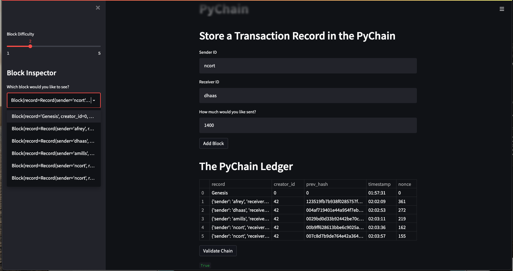
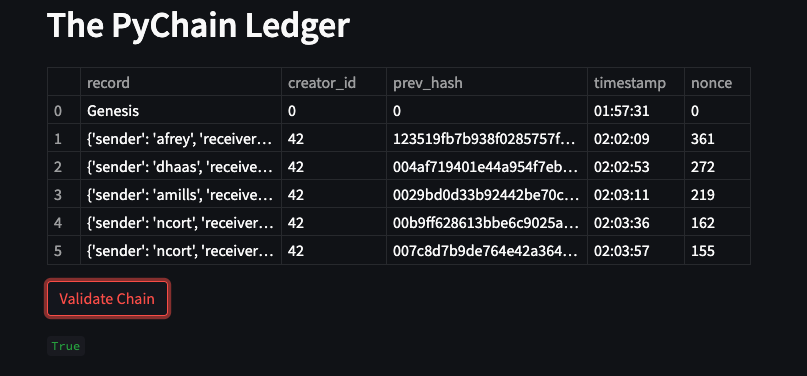

# challenge_18_blockchain_ledger
Week 18 Challenge, creating a blockchain-based ledger system, complete with a user-friendly web interface

## Using the ledger

- In the terminal, navigate to the project folder containg pychain.py

- Run the Streamlit application by typing `streamlit run pychain.py` in the terminal

- Enter values for the sender, receiver, and amount, and then click the "Add Block" button.

### Verifying the block contents and hashes in the Streamlit drop-down menu

### Testing the blockchain validation process by using the web interface

## Contributors

This analysis was created by Nico Cortese with support from the lovely Fintech Coding Boot Camp Team at Boot Camp Spot / Columbia School of Engineering

Nico Cortese

XXX-XXX-XXXX

XXXX@gmail.com

---

## License

MIT License

Copyright (c) 2022 NicoCortese

Permission is hereby granted, free of charge, to any person obtaining a copy
of this software and associated documentation files (the "Software"), to deal
in the Software without restriction, including without limitation the rights
to use, copy, modify, merge, publish, distribute, sublicense, and/or sell
copies of the Software, and to permit persons to whom the Software is
furnished to do so, subject to the following conditions:

The above copyright notice and this permission notice shall be included in all
copies or substantial portions of the Software.

THE SOFTWARE IS PROVIDED "AS IS", WITHOUT WARRANTY OF ANY KIND, EXPRESS OR
IMPLIED, INCLUDING BUT NOT LIMITED TO THE WARRANTIES OF MERCHANTABILITY,
FITNESS FOR A PARTICULAR PURPOSE AND NONINFRINGEMENT. IN NO EVENT SHALL THE
AUTHORS OR COPYRIGHT HOLDERS BE LIABLE FOR ANY CLAIM, DAMAGES OR OTHER
LIABILITY, WHETHER IN AN ACTION OF CONTRACT, TORT OR OTHERWISE, ARISING FROM,
OUT OF OR IN CONNECTION WITH THE SOFTWARE OR THE USE OR OTHER DEALINGS IN THE
SOFTWARE.